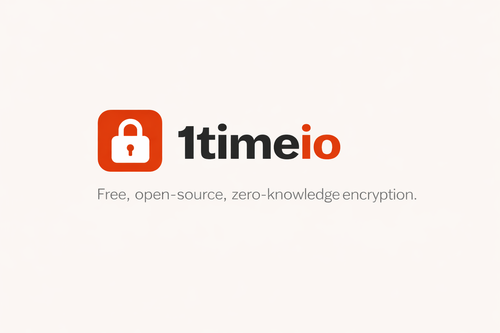
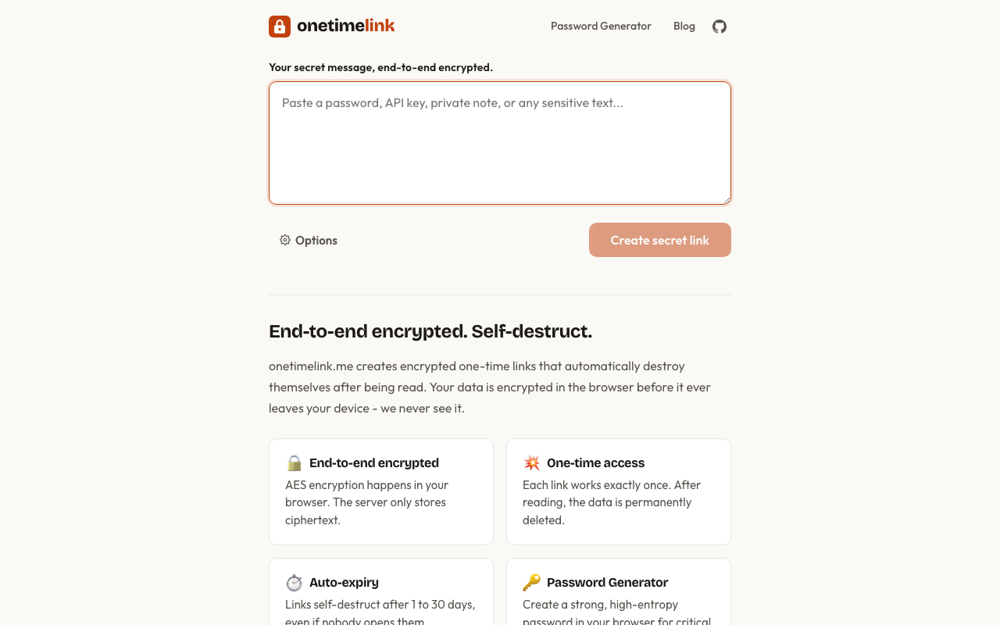
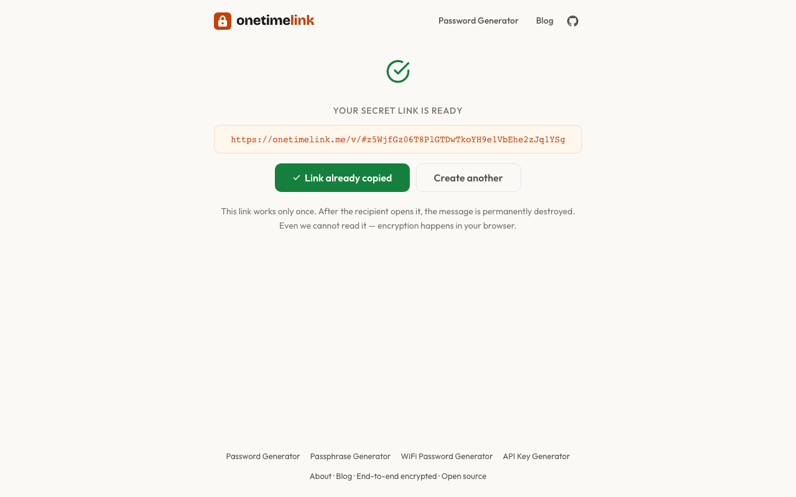

<p align="center">
  <a href="https://onetimelink.me">
    
  </a>
</p>

<p align="center">
  <strong>Zero-knowledge one-time secret sharing with end-to-end encryption</strong><br>
  Share passwords, API keys, and sensitive text through self-destructing links.
</p>

<p align="center">
  <a href="https://onetimelink.me"></a>
</p>

<p align="center">
  <a href="https://github.com/shingrus/1time/blob/master/LICENSE"></a>
  <a href="https://github.com/shingrus/1time/releases"></a>
  <a href="https://github.com/shingrus/1time/stargazers"></a>
  <a href="https://github.com/shingrus/1time"></a>
</p>

---

<p align="center">
  
  &nbsp;&nbsp;
  
</p>

## Why OneTimeLink?

| | Feature | Details |
|---|---|---|
| **🔐** | **Zero-knowledge encryption** | Secrets are encrypted in your browser with AES-GCM. The server never sees plaintext. |
| **🔥** | **Self-destructing links** | Each link works exactly once, then the data is permanently deleted. |
| **🏠** | **Self-hosted** | Run your own instance with Docker Compose in under 2 minutes. |
| **👤** | **No signup required** | Paste a secret, get a link, share it. No accounts, no tracking. |
| **🔑** | **Built-in generators** | Password, passphrase, API key, and WiFi password generators included. |
| **⚡** | **Lightweight stack** | Go + Redis backend, static Next.js frontend. Minimal resource usage. |

---

## How It Works

```
You                          Server                        Recipient
 │                             │                              │
 │  1. Type secret             │                              │
 │  2. Browser encrypts        │                              │
 │     with AES-GCM            │                              │
 │  3. Send encrypted blob ──► │  Stores encrypted blob       │
 │  4. Get link with key       │  (cannot decrypt it)         │
 │     in URL fragment (#)     │                              │
 │                             │                              │
 │  5. Share link ─────────────┼──────────────────────────►   │
 │                             │                              │
 │                             │  ◄── 6. Fetch encrypted blob │
 │                             │  7. Delete blob permanently  │
 │                             │  8. Send blob ──────────►    │
 │                             │                              │
 │                             │     9. Browser decrypts      │
 │                             │        with key from #       │
```

The encryption key stays in the URL fragment (`#`), which is **never sent to the server**. Even with full database access, secrets cannot be read.

**Cryptographic details:** Keys are derived using HKDF-SHA256 with a fixed salt. Two separate keys are produced — one for AES-256-GCM encryption and one for authentication (hash-based proof-of-knowledge). The server verifies the auth hash with constant-time comparison before releasing the encrypted blob, then permanently deletes it.

---

## Quick Start

### Use the hosted version

**[onetimelink.me](https://onetimelink.me)** — free, no signup, ready to use.

### Self-host with Docker Compose

**Option 1: Pre-built images (recommended)**

```bash
curl -O https://raw.githubusercontent.com/shingrus/1time/master/docker-compose.yml
curl -O https://raw.githubusercontent.com/shingrus/1time/master/.env.example
cp .env.example .env
# Edit .env: set APP_HOSTNAME to your domain
docker compose up -d
```

**Option 2: Build from source**

```bash
git clone https://github.com/shingrus/1time.git
cd 1time
cp .env.example .env
# Edit .env: set APP_HOSTNAME to your domain
docker compose -f docker-compose.dev.yml up -d --build
```

Both options start on `http://localhost:8080` with Redis persistence, the Go API, and nginx serving the frontend. Multi-arch images (amd64 + arm64) are available.

### Configuration

| Variable | Default | Description |
|---|---|---|
| `APP_HOSTNAME` | `onetimelink.me` | Public hostname for links and metadata |
| `APP_PORT` | `8080` | External HTTP port |
| `DATA_DIR` | `./data` | Host path for Redis persistence |
| `SHOW_BLOG` | `false` | Enable blog routes (for hosted version) |

Put your own reverse proxy (Caddy, Traefik, nginx) in front for HTTPS/TLS termination.

> **Note:** The frontend image is generic — changing `APP_HOSTNAME` does not require rebuilding. The hostname is injected at container startup.

---

## Comparison with Alternatives

| Feature | **OneTimeLink** | OneTimeSecret | Yopass | PrivateBin | Password Pusher |
|---|:---:|:---:|:---:|:---:|:---:|
| Zero-knowledge (E2E encrypted) | **Yes** | No | Yes | Yes | No |
| Self-destructing after first read | **Yes** | Yes | Yes | Optional | Optional |
| No signup required | **Yes** | Yes | Yes | Yes | Yes |
| Self-hosted Docker Compose | **Yes** | Yes | Yes | Yes | Yes |
| Built-in password generators | **Yes** | No | No | No | No |
| Lightweight (Go + static HTML) | **Yes** | No (Ruby) | Yes (Go) | No (PHP) | No (Ruby) |
| Open source | **MIT** | MIT | Apache-2.0 | zlib | Apache-2.0 |

---

## Free Tools

- [Password Generator](https://onetimelink.me/password-generator) — strong random passwords
- [Passphrase Generator](https://onetimelink.me/passphrase-generator) — memorable multi-word passphrases
- [API Key Generator](https://onetimelink.me/api-key-generator) — random tokens for developers
- [WiFi Password Generator](https://onetimelink.me/wifi-password-generator) — easy-to-type network passwords

---

## Tech Stack

| Layer | Technology |
|---|---|
| Backend | Go (stdlib, no frameworks) |
| Storage | Redis with RDB persistence |
| Frontend | Next.js (static export) |
| Encryption | Web Crypto API (AES-256-GCM, HKDF-SHA256) |
| Deployment | Docker Compose + nginx |

---

## Development

### Requirements

- Go 1.25+
- Redis 8+
- Node.js 25+ and npm

### Backend

```bash
# Start Redis locally
export REDISHOST=127.0.0.1:6379
export REDISPASS=

# Run the backend
go run .
# Listening on http://127.0.0.1:8080

# Tests
GOCACHE=/tmp/go-cache go test ./...
```

### Frontend

```bash
cd frontend
npm install
npm run dev
# Dev server on http://127.0.0.1:3001, proxies /api to Go backend

# Production build
npm run build

# Tests
npm test
```

### Full build

```bash
make build
# Produces: bin/1time (backend) + frontend/build/ (static assets)
```

### VM deployment (Ubuntu/Debian)

```bash
make build
sudo ./scripts/init_vm.sh
```

Installs nginx, Redis, creates the `onetimelink` systemd service, and deploys the built artifacts.

---

## Contributing

Contributions are welcome! Please open an issue first to discuss what you'd like to change.

1. Fork the repository
2. Create your feature branch (`git checkout -b feature/amazing-feature`)
3. Commit your changes
4. Push to the branch
5. Open a Pull Request

---

## Security

The encryption model is designed so that **the server operator cannot read secrets**, even with full database and infrastructure access. If you find a security vulnerability, please email the maintainer directly instead of opening a public issue.

---

## License

[MIT](LICENSE) — Copyright (c) 2018-2026 onetimelink.me
